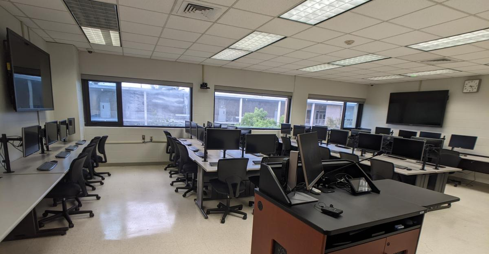
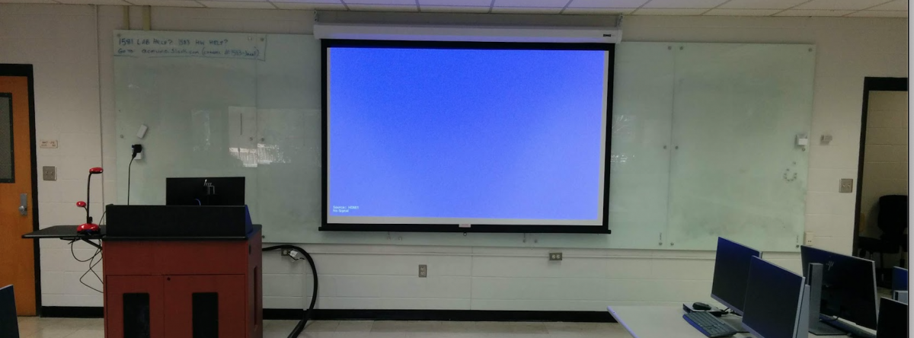
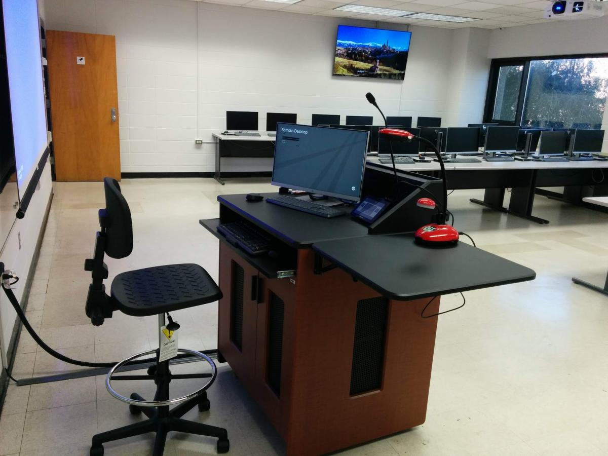

# The Student

A 2D/3D game built in Unreal Engine 5 as a university game design course project.

## Demo

*Click the image to watch on YouTube*

## What it is

A 2D/3D game combining both perspectives/mechanics, built and demoed as part
of a class project. Playtested with multiple players during class demonstration.

## My role

Implemented gameplay mechanics, camera systems, and player interactions.
Used Git version control (branching, merging, conflict resolution).

## Built with

- Unreal Engine 5 (Blueprints / C++)
- Git for version control

## Notes

A few minor bugs remained unresolved at submission due to time constraints,
but the game ran well during class demonstration and playtesting.

## Inspiration Images From LSUNO CS Classroom

These were major references for me creating the world that I did in the game,
jumping through all the computer screens navigating around the classroom and 
eventually making it up to the front of the room.

